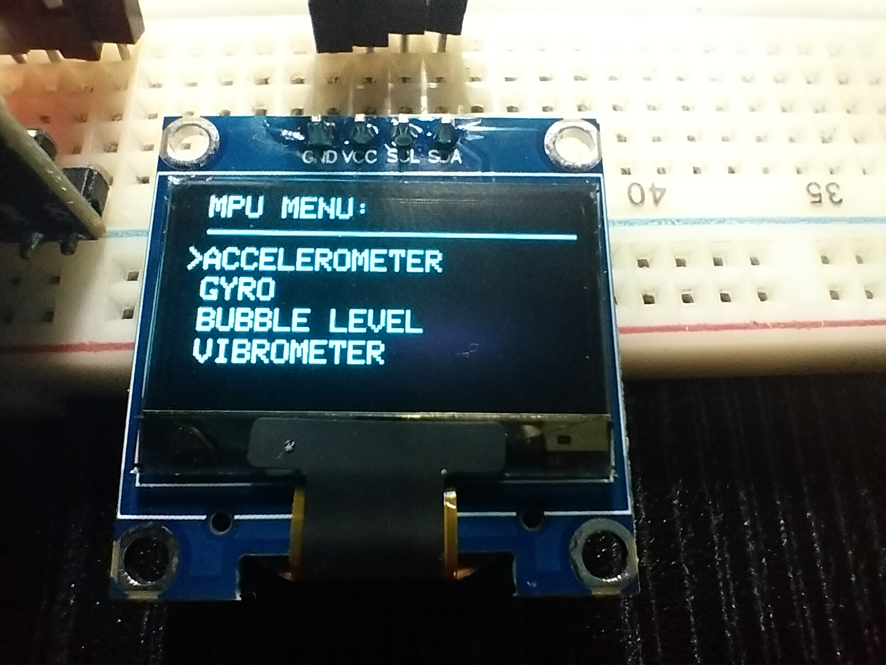
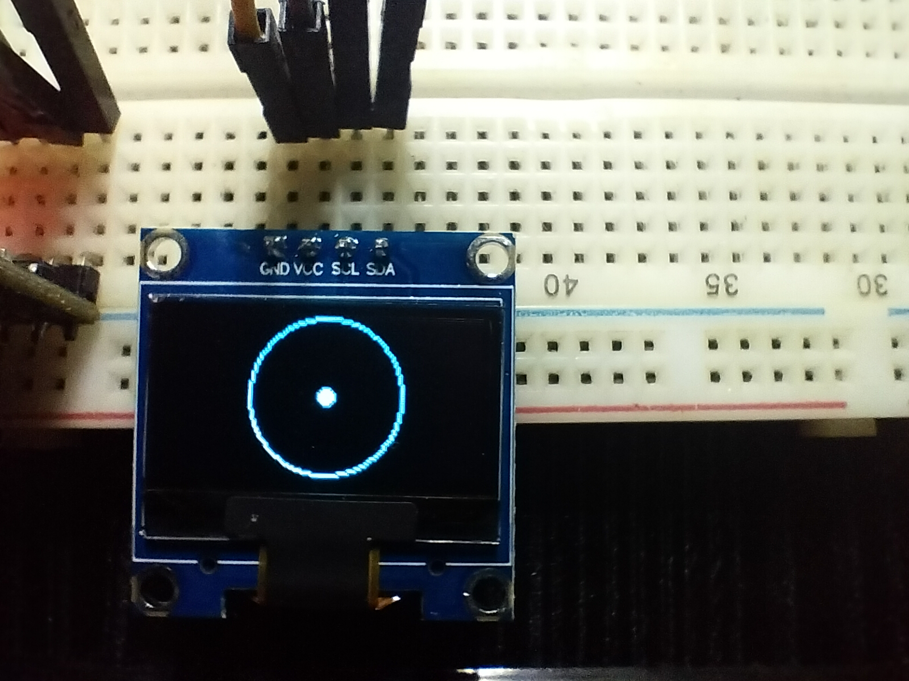
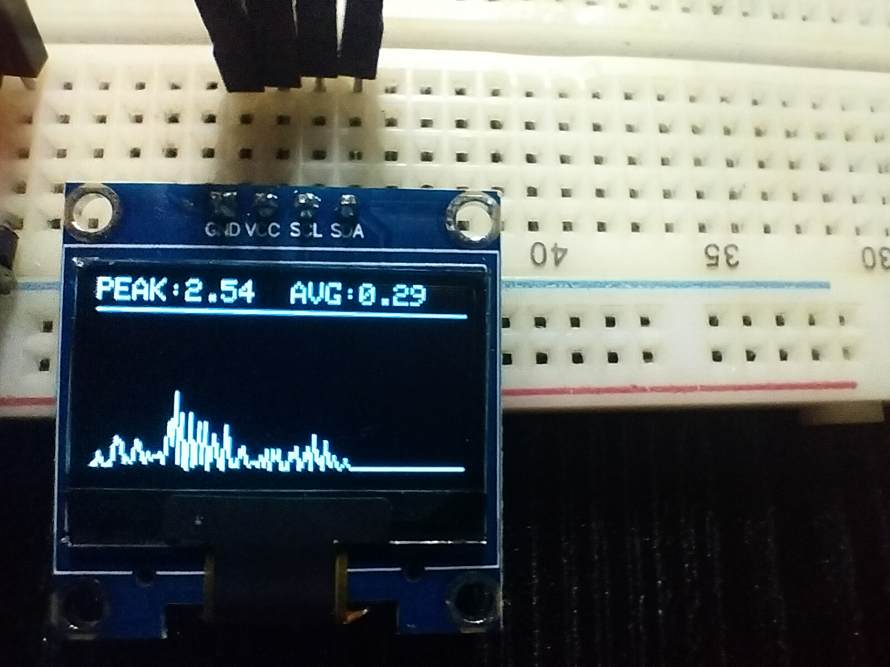
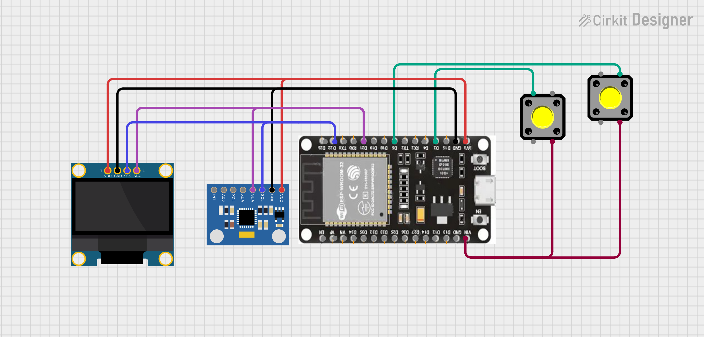

# ESP32-MPU6050-MultiTool

A multifunction embedded systems project built using ESP32, MPU6050 and SSD1306 OLED display.

## Features

- Accelerometer Monitor
- Gyroscope Monitor
- Bubble Level Indicator
- Vibrometer
- Real-Time Vibration Graph
- OLED Menu Navigation

## Hardware Used

- ESP32
- MPU6050
- SSD1306 OLED Display (128x64)
- Push Buttons
- Breadboard and Jumper Wires

## Pin Connections

| ESP32 | MPU6050 |
|--------|---------|
| 3.3V | VCC |
| GND | GND |
| GPIO21 | SDA |
| GPIO22 | SCL |

| ESP32 | OLED |
|--------|------|
| 3.3V | VCC |
| GND | GND |
| GPIO21 | SDA |
| GPIO22 | SCL |

| ESP32 | Button |
|--------|--------|
| GPIO2 | Menu Button |
| GPIO5 | Select Button |

## How It Works

The ESP32 reads motion data from the MPU6050 sensor and displays different tools through a menu-driven OLED interface.

### Accelerometer Screen
Displays X, Y and Z acceleration values.

### Gyroscope Screen
Displays angular velocity on all three axes.

### Bubble Level
Maps sensor tilt to a movable bubble on the OLED display.

### Vibrometer
Calculates vibration magnitude and displays:
- Peak vibration
- Average vibration
- Real-time vibration graph

## Libraries Used

- Adafruit MPU6050
- Adafruit SSD1306
- Adafruit GFX
- Adafruit Unified Sensor
- Wire

## Project Status

✅ Version 1.0 Complete

## Future Improvements

- Data Logging
- Bluetooth Connectivity
- Calibration Menu
- Improved Graph Scaling

## Hardware Setup

## Main Menu

## Bubble Level

## Vibrometer

## Schematic

